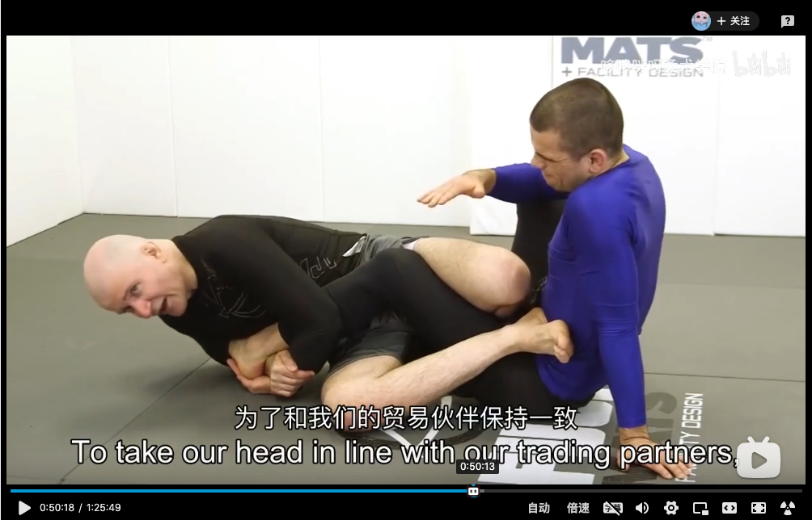
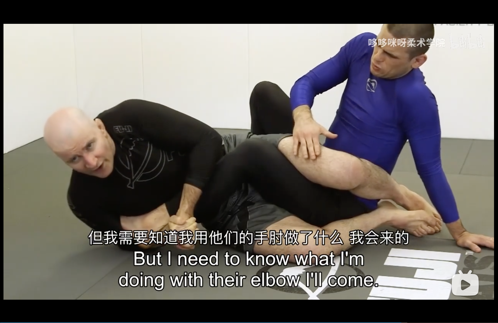

# John Danaher Leglock Episode 3
## Single Leg Ashi Garami 

* Inside foot in under opponent's butt
* Push forward then turn hip

## Double leg Ashi Garami

* Opponent breaks the lock
* Cross leg to the butt to push the opponent forward
* Hold the second leg
* Reobtain ashi garami and sweep

## X guard and Ashi Garami

### Example 1
* X-guard sweep (move farside foot to be behind the ankle)

* Pummel foot to inside position and sit up

* Push the right foot, hand on the mat, then roll for the leg

### Example 2
* Bring far leg to yourself by lifting the left knee

* Push down to sweep

* Enter Ashi Garami

## Exposing the heel

### Lifting method in Ashi Garami
* Enter to the heel hook, elbow on the knuckles
* Line up forearm with the foot to avoid slipping foot
* Use palm or wrist to lift the foot  

* Rotate the elbow back, line the forearm with the foot no the shin to avoid foot slipping, this compresses the shoe laces to the rib

### Lifting method in Cross Ashi Garami
* Lift the heel higher than wrist

* Rotate elbow to secure position, hands lock

### Central line method
* Opponent is defending with heel on the floor and toes pointing towards you, this might make the lifting method harder
* Put the foot on the opponent's hip and use hand to control the knee
 
* Pass the foot across the center line, this will make the opponent struggle to hide the foot. Turn to expose the heel

### Tilting method
* In cross Ashi posisiton, hook the far leg and bring foot back

* Lift and tilt the opponent

* Lock back to figure 4 and then come back

## Negating Resistance
### Leg pummeling and leg switching
#### Option one: switch to opposite side Ashi Garami
* Opponent opens the Ashi Garami and sits on the leg
* Set up an Ashi Garami on the opposite leg, hold the opposite leg when losing control

#### Option two: switch to opoosite side Outside Ashi Garami
* Opponent is escaping, switch to inside Ashi Garami of the second leg first, left foot is inside and on opponent's hip
* As opponent rolls, follow him to establish an outside ashi garami

## Breaking Mechanics
### General theory
* Establish a pushing force and pulling force
* First pair of pulling and pushing forces
    * Apply a pushing force on the toes using the body
    * Apply a pulling (lift) on the heel

* Second pair of pulling and pushing forces
    * Pointing the knee inwards
    * The heel hook grid is pushing outwards (towards the chest)

### Slack Removal
* One key slack to remove is the elbow position

* Use head position to remove also slack

### Gripping
* Palm to Palm grip
    * Create too much space
    * Use the frame arm to come inside the shin bone
    * Downforce on the shin, lifting force on the heel

* Wrist to Wrist grip
* Figure 4 grip
* Reverse Figure 4 grip

### Breaking mechanics for outside heel hooks

#### Basic form
* Head position
* Opposing forces, ash garami going out, heel hook going in
* Elbow tight

#### When opponent is escaping
* Change feet to figure four to prevent truning
* Focus on straghtening out the leg
* Lift the hip

### Breaking mechanics for inside heel hooks

#### Single shoulder finish
* Bring elbow inside
* Single shoulder finish
* Hip come off the floor
* Ping the foot and then straighten the hip

#### Flat back finish
* Forearm lined up, bring the support hand to the hook hand
* Two feet pressure down in figure 4
* Feet down and hips up

