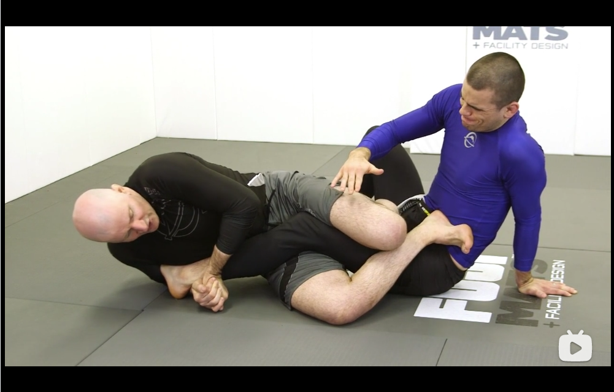
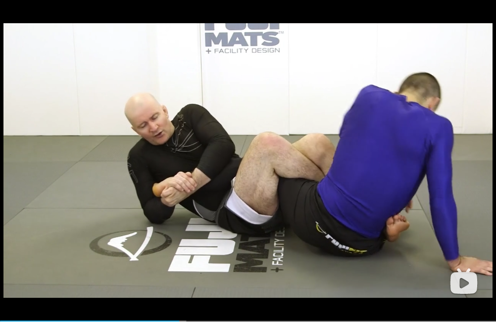

# John Danaher Leglock Episode 4

## Straight Ashi Garami System

* Definitions
    * Primary leg: the leg held inside the ashi garami
    * Secondary leg: the leg that is outside the ashi garami
    * We (the knees) tend to face towards the primary leg

* The main attack in stragiht ashi garami is the *outside heelhook*

### Shared Spiral Problem

* Why: heel hooks would require a sprial force on the heel hook, most opponents will try to escape in the same spiral direction as the heel hook.
* The force of the heel hook and the force of the knee (aka. the force of ashi garami) should not be aligned.
* Two main ways of preventing the spiral problem

### Single Ashi Solution to the Shared Spiral Problem
For opponents with limited skill level.

Recap of the important details of straight ashi garami

* Left knee pushing into the thigh
* Lift the hip
* Lift the heel

 

The simplest means is to roll with the opponent, but keep the feet in position. Lift the hip off the floor to prevent rolling.

### Multiple Ashi Solution to the Shared Spiral Problem
Understand heel hooking a series of tasks, you will need switching between ashi garamis

### Exposing the Heel in Straight Ashi Garami

* Directly hunting for the heel is very dangerous, it exposes your heel to the opponent, because the inside leg is unweighted.

* Use of the central line method
    * Shift the hips to the outside
    
    * Pass the foot across opponent's thigh (inside ashi garami)
    
    
### Negating the opponent's resistance
Although inside ashi is good for exposing the heel, it is very easy to cause the opponent to roll and then escape.

* We use inside ashi garami to expose the heel
* Opponent can kick out easily if it is inside ashi 

* Establish a far hip ashi garami (Senkaku)
    * Only do this if you have the heel
    * make sure the far foot is tightly close to opponent's hip to avoid figure four toe hold
    * the runout after turning is significantly harder
    

### Breaking
* Establish outside ashi garami
    * After rolling in the Senkaku position
    * Hard to separate the cross feet
    * Knees are in opposite positions to the heel hook
    * Normally used in the last step in the sequence
    * In a shared spiral, use the shoulder to roll
    * Lift the hip to avoid shared spiral

### Roles of inside and outside legs
* Inside leg is used to apply breaking force for the heel hook in Straight Ashi Garami
* We switch to outside leg dominance when exposing the heel
* Then outside leg will always take control
* At the end, in the submission finish in the outside ashi garami, the inside leg will be dominant to apply finishing force.

## Stop the Shared Spiral
* Direction of the force in an Ashi Garami
    * Normally aligned with the direction of the knee
    * Sometimes frequently changing the ashi garamis is not desirable

* Single Ashi Garami in four tasks
    * Place a sticky hook using the left hook to get heel exposed
    
    * Stop or slow down the spiral using the sticky hook
    
    
### Evaluting two different methods

* Far hip ashi garami
    * There is always a danger on the far side foot
    * A stronger closed wedge
    * Finish in outside ashi garami has a back exposure problem
* Sticky hook based ashi garami
    * Double trouble by controlling the secondary leg
    * Open wedge probelm, primary leg can be unlocked easily
    * Open wedge probelm, secondary leg can be pummeled to be attacked

* A solution in the middle
    * Inside ashi garami expose the heel
    

    * Use the sticky hook to slow down the roll
    
    
    * Switch to outside ashi to have a closed wedge
    

