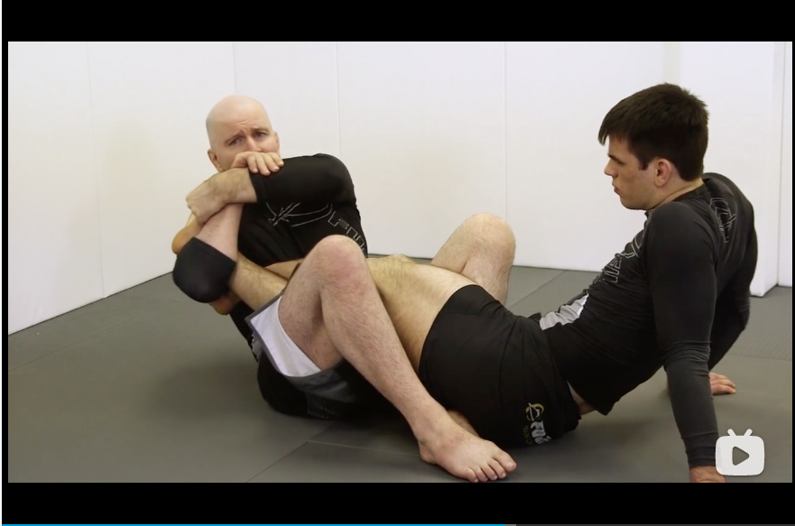
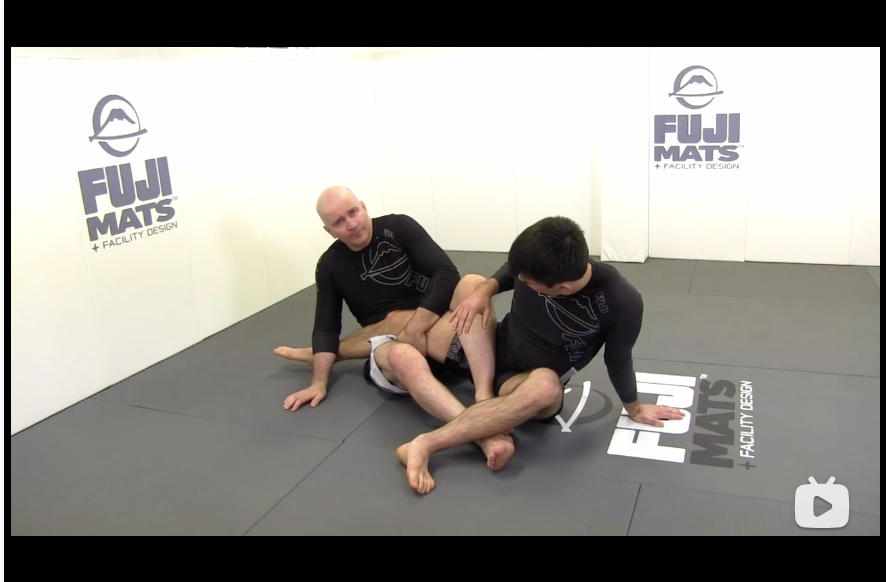

# Cross Ashi Garami

## Introduction to the system
It is in general safer if we can put both legs inside the opponent's legs.

* Catch the secondary leg of your opponent will disable his escape
* Stronge breaking force for heel hook
* Can transform to closed wedges like senkakus

## Differences and similarities between straight and cross ashi garamis

* Similarity
    * Knee and kneeline: maintain the kneeline relationship
    * Place an extra wedge using your hand, the hand wraps behind the opponent's primary leg elbow deep to drag him back to maintin the kneeline.
    
    
* Differences
    * Two legs in front in cross ashi garami
    * Damage in the inside of the leg in cross ashi garami

## Primary and secondary legs

Most of the escape potentials come from the secondary leg
* Rotate the secondary leg
* Pummel the leg in to counter 

* The solution is to control both the primary and secondary legs

## Turnout problem in cross ashi garami
* If the opponent is turning in
    * This will expose the heel
    * Transform to a outside senkaku to finish

* If the opponnet is moving straight backwards
    * Really hard to move out because of the closed wedge

* The turnout approach
    * Hide the heel
    
    * Knee slip
    
    

## Double leg cross ashi garami
This solves the turnout problem but creates the release problem
* Wrist deep two on one grip on the leg

* Lock up the secondary leg

* Recover knee line using underhook of the left hand

## Managing the release in double leg cross ashi garami
* Solution one: do not release (Achilles Grip)
    * Pass the arm inside and under the right arm, thumb is really close to the ankle, hand is below the ankle
    
    * Switch to reverse figure four grip
    
    * Opponent has to engage the hand fight
    
    * Switch to heel hook
    
    
* Solution two: an alternative achiles grip
    * Free hand goes under the knee
    
    * Place the wrist near the ankle
    
    * Throw the ankle in front, so that the heel is on the chest
    
    * Figure four grip to finish
    
    
* Solution three: double heel hooks
    * Grab around the carf and turn to expose the heel
    
    * Punch through for a heel hook
    
    * Transform the initial bite to a figure four grip
    
    * Place the elbow to the primary leg and point towards opponent's hip
    
    * Opponent will have to turn to the direction of the heel hook, attack the primary leg and the inside senkaku to block turning
    
    
* Solution four: direct attack on primary leg
    * Punch in for the primary leg
    
    * Align the hand to the direction of the toes
    
    * Turn and push the hip to finish
    
    
## Managing the release using splitter hand and splitter elbow
    
* Lift and insert a splitter hand

* Lock up heel hook on primary leg

The secondary leg introduces an interference problem

* Solution one: Knee crunch with splitter hand
    * The opponent will try to insert the secondary leg to amplify the interence problem
    * Use the left knee to push the secondary leg out
    

* Solution two: Elbow slicer
    * Use the hand splitter
    
    * Hold the primary leg, use body weight to push elbow in between
    
    
    * Lifting method to expose the heel
    
    
    
* Solution three: Over and under control
    * Hand push down the calf, elbow tight to lock
    
    * Punch through to control the secondary leg
    
    * Use the inside butterfly hook to sweep the opponent
    
    * Lock the inside senkaku and reach for the heel.
    
    
* Solution four: Double elbow
    * Establish the over and under control, hold the primary leg using the left hand
    
    * Easy transition to inside heel hook
    
    
* Solution four: Doublw cross method
    * Establish the over and under control
    
    * V grip and pull to push the leg across the body
    
    
## Shared spiral in cross ashi garami
When we do not have the secondary leg, the opponent will turnout
* Left hand hold inside the thigh

* Put elbow in the inside position

* Put the head on the floor when rolling, and place a sticky hook

* Enter inside senkaku in the shared spiral

