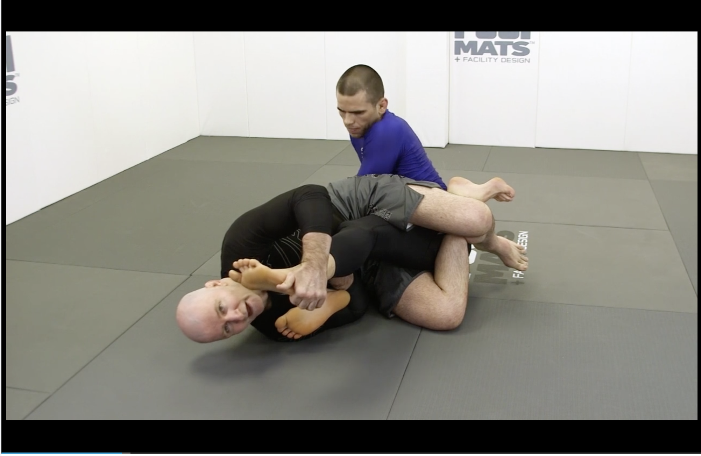

# Reverse Ashi Garami

A position that allows a transmission to other positions and also other leg lock techniques.

For example, we can transmit to outside ashi garami by sitting to the inside.

Or transmit to cross ashi garami by sitting to the outside

## Central problems in reverse ashi garamis

#### First problem: stabability problem

The reverse ashi garami position is inherently unstable.
Widen the base causes leg pummeling problem.

#### Secondary problem: entaglement problem

The opponent can use the secondary leg to protect the primary leg.

## Untying the legs

* Move the legs upwards to avoid the tight triangle lock. We should put one hand on the knee and one hend on the foot to bring up the feet.

* Sit with two knees pointing the same direction. One hand on the ankle and one hand on the toes of the top foot.

* Make sure the elbow is inside his shine to avoid kick out.

## Double Roll
* Start with the knee and put the knee on the floor

* Bring the head down and outside the foot, this is very important since this movement gives you a better starting point for the race. Hug the foot using the hand.

* Lock a senkaku 

* Use the secondary hand to block without releasing the leg, the senkaku becomes a half senkaku, the lock is now on the calf muscle. 

## Double Trouble
* Bring in the triangle and grip on the foot, four fingers cover four toes.

* Bring the foot on the knee, cross the legs of the opponent. Now also use the secondary hand's elbow to push down the leg.

* Secondary hand can now be on the floor and fold the knee

* This then enters the toe hold position

* Now also can switch to knee bar if the opponent defends with the other leg

## Toe hold on the primary leg
* Open up the legs and never have a foot a long way from the head. Bring the head towards the toes. Try to bring everything in.

* Put the foot down and sit through

* Make sure the secondary hand is covering the primary hand. The body goes down to the floor. Place the toes further to the hip 

## Toe hold in non-optimal positions
* When legs are extended, keep the head close to the toes

* Lifting the foot can avoid the backtake 

## Reverse to Outside Ashi
* Place the knee on the ground, thumb down to catch the heel

* Use the secondary hand to pose and help the sit through

* Go down to the elbow

## Reverse to Cross Ashi
* This time, we use the right hand to secure the heel and left hand to untie the legs!

* Lift the heel over the knee, release the right hand, put the elbow of the right hand to the shin to double up the wedge. Left hand goes elbow deep to trap the heel.

* Now use the right hand to pose on the knee, and pivot the knee

* Sit to a double trouble cross ashi position

## Transition in three ashi garamis

### Straight to Cross
* Two on one grip on the butterfly

* Enter ashi garami

* If the opponent is not exposing the heel and he unlocks the left leg, control on the leg and the head.

* Pummel the leg to enter reverse X guard

* Knock the opponent's hips above the head in reverse X, punch the leg through and around to lock a senkaku

### Straight to Cross when opponent is defending
* The opponent turns too fast, the defensive movement is to put the foot across and sit up.

* Control the secondary leg or heel hook the primary leg

### Static crossover
* Holding in a double control position, a great control position

* Establish an inside senkaku, use a left foot bridge to send the foot across

* Sit up to bring the secondary leg

### Spin leg to cross ashi
* When we start to lose the leg

* Sit up and fold the leg to put under the opponent's leg. Also make a scoop grip on the opponent's knee.

* Elbow escape to put the knee inside the opponent's legs

* Chest over the thigh and hand posting on the floor, make the knee to slice across the thigh

* Spin and place the wedge to enter cross ashi garami

### Spin leg to rever ashi
* Scoop the knee and shoot the other hand across.

* Sit onto the opponent's hip

### Rolling from cross to straight
* It is very dangerous to have no heel control in outside ashi, the back might be exposed

* When the opponent is climbing the back, hold the ankle using the right hand, the free hand under the arm pick. Position the head inside the knee.

!