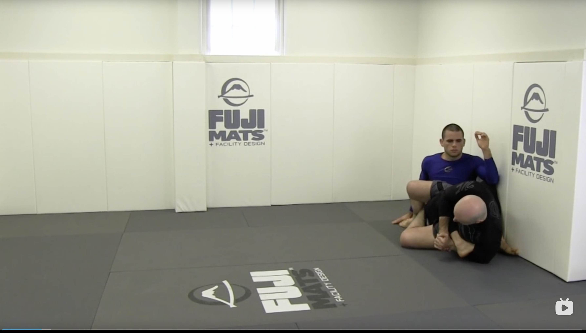
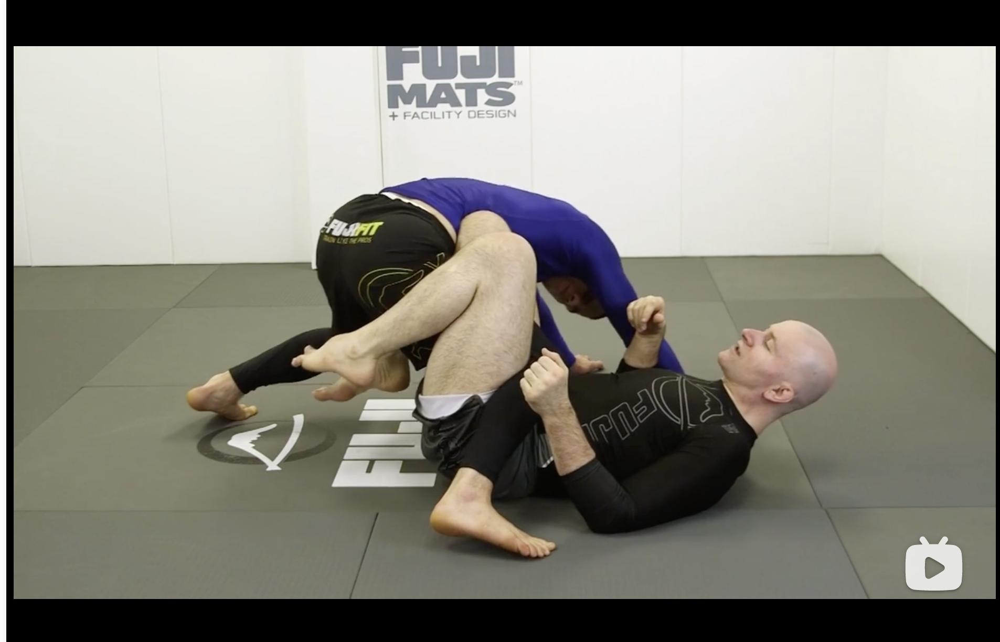
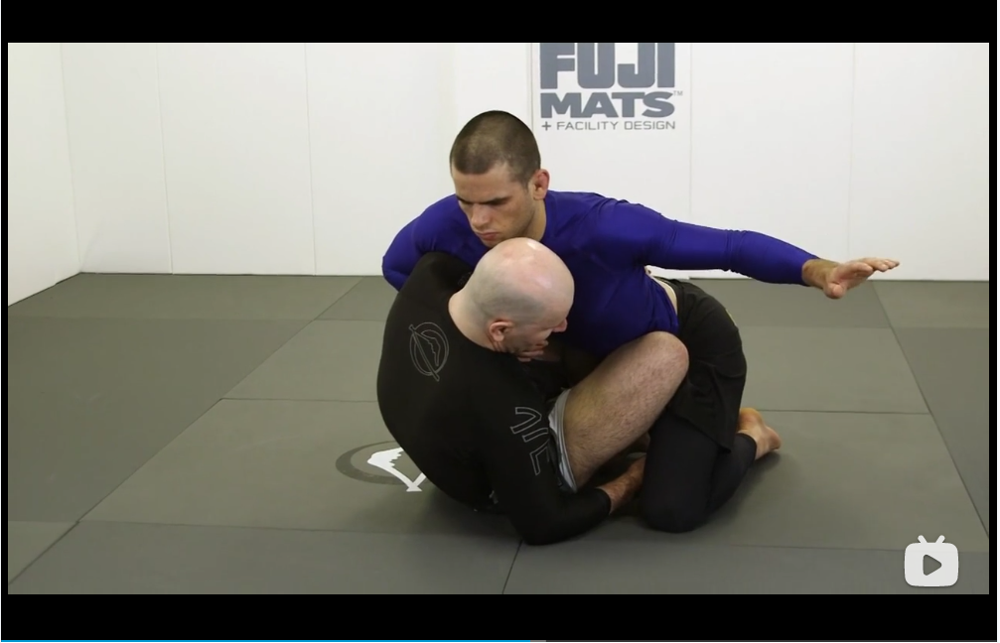
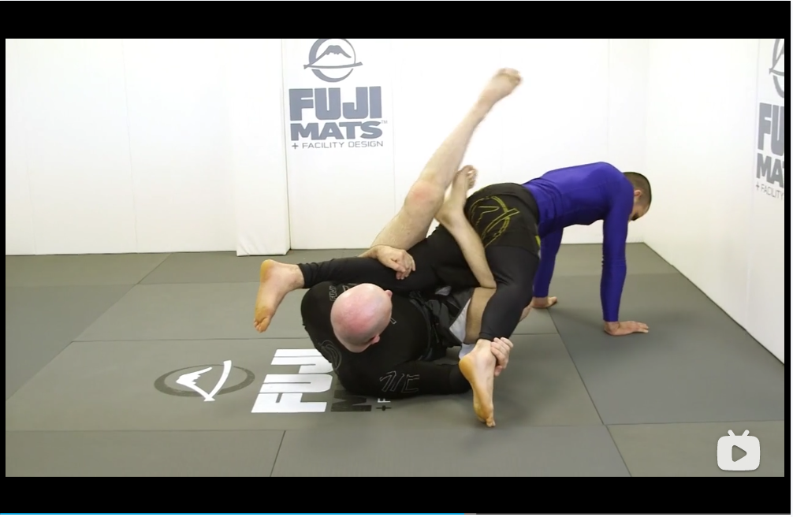
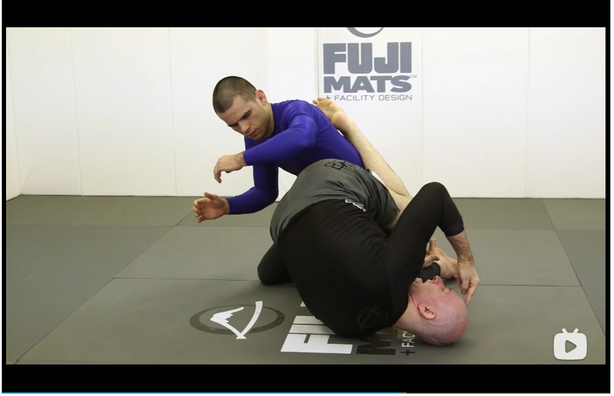
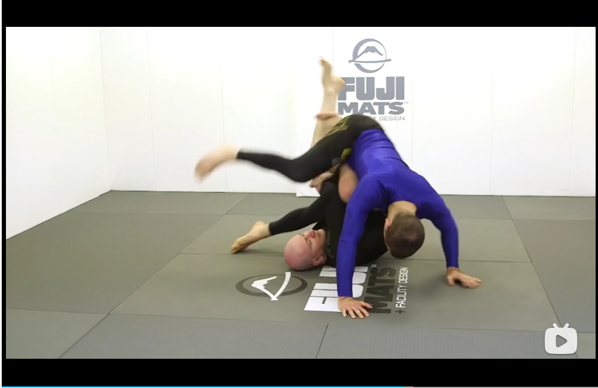
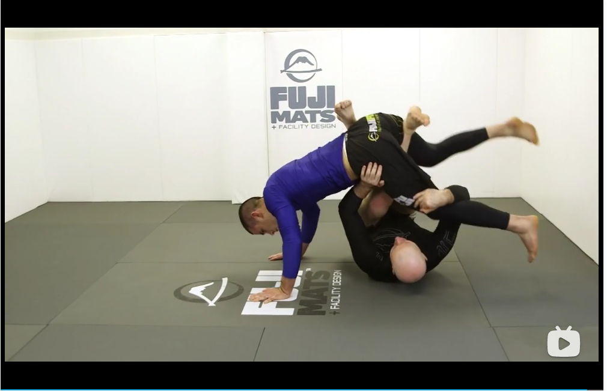

# Leglock Entries

## Standing entries

### Standard takedowns
* Level change and touch to guage distance

* Slide the knee and hold the leg for the takedown

* After pulling, wrap the leg

* Can easily roll through to a breaking position

### Collaring elbows
* Collar elbow and bicep grip, and square up the opponent by moving out to the side and pull.

* Step the leading foot and fall across the center line, make sure the left foot goes out and penetrate the opponents' legs

### Double leg entry
* Starting from a double leg takedown scenario

* Fall with an angle and wrap around the leg

### Single leg entry
* Starting from a failed high single leg takedown. Normally, you would like the foot you want to attack to be close to your own foot. So you force the opponent to step forward by steping back the leading foot.

* Run for the second hip, opponent moves the leg out to defend

* Lower the level and shoulder pump the opponent to the floor. Pose the hand and hook the leg.

* Sit down and move away

### Head lock entry
* Fake the takedown attempt to go to the headlock

* Go under the armpick and reach for the farside leg

* Switch knees and ready to penetrate the legs

* Catch and pose on the ground to sit to cross ashi

### Arm drag
* Arm drag in standing to enter take down

* Left knee sweeps inside to establish ashi garami 

## Ground entries

### Butterfly guard (Double elevator)
* Use the butterfly guard to push the opponent

* Use the hand to push the opponent even further

* Then turn to enter the leg lock position

* Turn with the opponent if he is turning away to enter straight ashi garami

* If he tries to stand up, elevation and then cross ashi

### Buttom half guard (Single elevator)
* If the opponenet is trying to tripoting up, the opponents' knees are hight. Pinch two knees on opponent's leg (do not cross a triangle), use the inside leg to hold down opponent's leg. 

* Pummel the outside leg in to be used as an elevator. If needed, clamp the inside leg to strength the control.

* When it is time to move, use the controlling leg to bridge and kick with the inside hook. When kicking, make sure the hand is also pushing the opponent's hip.

* Use a double thumb pose to clear the hand.

* Aim the inside knee to pinch in, and use it to create distance for the outside leg to wrap in. Do not straight wrap in as it requires great flexibility.

* Use the inside knee to create distance! and then wrap with the outside leg.

### Crossed feet elevator in butterfly
* Put one leg forward, and one leg behind. The leg behind the hook to the outside of the opponent's knee.

* One hand on the ground and the other hand tightly holds on the opponent's back.

* Make sure the right hand touches the opponent's knee and my knee touches the pocket of the hip.

* Form a cross arm frame. Leg extends and body pivots to the training partner. Make sure the pivot is more than 90 degrees and the hand is heping

* Lock a triangle and back to cross ashi garami

### Inversion based game
* Start in a sitting position

* Catch one leg, and throw in a reverse DLR hook. Switch the grip of the DLR hand. 

* Focus on grabbing the other knee of the opponent but also send your own knee between the opoonent's legs.

* Throw the opponent forward by kicking the legs

* Position right foot in the middle, move out the left leg. Lock to figure four and enter cross ashi.

### Knee shield inversion
* Knee is shallow and not too far across the belly of the opponent. Forearm frames on the attacking hand.

* Drive the lower hand deep under the knee, and use the upper hand to be beneath opponent's arm pick

* Move the knee now to the far-side hip and start to pivot the leg behind the opponent's back.

* It is so important to make sure that the head is inside, and use both hands to hold the opponent's leg. Then use the free leg to kick sweep and lock a senkaku.

### Knee shield to X guard
* Touch for the knee and left hand is under the arm pick.

* As the opponent sits back, it is harder to move them, but we can move the left leg in to establish a butterfly hook. And the left hand goes down and lock hands. Use the right leg that is on the floor to prepare a sweeep.

* After the sweep, you can go to x-guard, but we go to a reverse x here.

* Make an elevation, come back and lock the legs

### Failred to swep to reverse X
* Fails to do a butterfly sweep, but establish control on one leg and frame on one arm.

* Push on the mat to knock the opponent to the other side.

* Drive leg comes through underneath to enter reverse x.

### Arm drag
* Slide in an inside leg and in the arm drag position

* Opponent put the foot up to defend.

* Hold the standing leg and use the left foot to cross control to prepare for the lift.

* Lock on the foot to finish

### Collar and heel methods
* Catch in one motion on the head and the heel, when opponent is trying to pass the leg

* Sit in and use the right foot to have a cross butt control

* Pull the opponent in, start the elevation and establish cross ashi garami control

### X to reverse X guards
* X guard, punch down the opponent, the opponent is moving away and hard to lift.

* Shoe laces to shoe laces to lift the leg, and return to a seated position

* Then we put back the reverse X, sit down again to enter cross ashi

