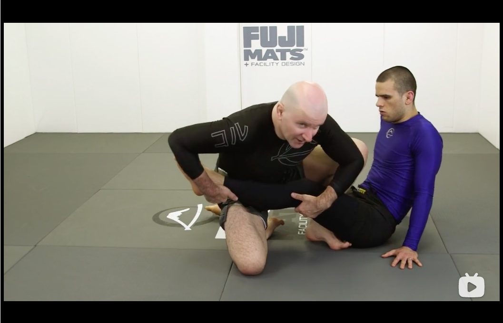

# Leg Entries from standing

## Step to the inside

* One hand on the foot, make sure step pass the opponent's hip line. Second hand comes down to establish a two on one grip. Make sure there is a level change down, the hip is on the same level as the opponent's knee.

* Step the other foot to the hip line

## Step to the outside

* Level change and step to the hip line.

* As the sit goes in, reposition to catch the heel.

## Inside out entry

* Establish a scoop grip on the leg, pose on opponent's chest

* Do a kneecut and drive the knee to the floor 

* Lift the hand up to the heel, pose the hand and left foot goes to the buttx

* Slide the knee out and start to turn

## Outside in entry

* One hand pins a leg, the other hand is changed from a scoop position to posing on the opponent's hip. Standed up and entered a tripot position.

* Step in and make sure the right foot is facing away from the opponent's head. In the same time, throw around the left foot.

* Enter a cross ashi with a two on one control on the leg.

* Shift the hip again to enter heel hook

## Outside step in entry
* Step into a leg drag position. Make sure the leg is secured with a grip on the opponent's knee. Make sure the level is low.

* Put the knee in, sit and pinch the knees. Later send the other foot in.

## Half Guard Entries

### Method one
* See opponent pummel for the underhook, counter with a scoop grip on the leg

* Pose the hand on the ground and pose the kneed on the opponent's hipline.

* Sit back to put weight on the opponent.

* Reposition right leg to the opponent's buttx, and move the posing hand on the mat further away

* Sit down with leg pinched

### Method two
* If opponent's got his elbows close and not doing the hand fight.

* Catch the wrist on the side

* Do not slide through but step over. Two on one on the top leg, catch the heel and control the knee.

* Lift and control both legs

* Step through the other leg and lock

* Lock up on the heel and fall on the side to enter outside ashi garami

### Method three
* The opponent traps the knee.

* Pose with both hands, turn the hip to the side of the legs, and pop up to free the knee

* Move the right hand to the left hand

* Back step and use the knee to wedge on the opponent's knee

* Now put the foot on the floor and fall back, in the same time, catch the other leg.

## Fighting against a seated opponent
* Push and step in, make sure the opponent has one hand posing on the floor. The attack leg is behind.

* Step the second leg, level change and wedge the opponent's left leg. At the same time, make sure grabbing the opponent's right leg.

## Double seated position

### Eneter outside ashi garami
* Pummel the foot to a inside position. Make sure the foot pummeled in is in a cross buttx position, so that the opponent cannt re-pummel. Make sure two knees are closed, two feet are closed.

* Keep a two on one grip on the leg.

* Use the feet to move up opponent's kneeline, at the same time, also try to sit in. Also punch through to enter the outside ashi attacking position.

* Use the right foot, pass it across the centerline to expose opponent's heel

* Start rolling through and lock the senkaku.

### Enter cross ashi garami
* Break the opponent's grip and pummel to the inside position

* Switch the other feet to be both in the same direction.

* Fold the near side foot, pose a hand on the floor and the other hand is controlling the neck

* Stand using the knee

* Change the level using the knee, reach back the other leg and punch through the other leg.

### Eneter cross ashi by faking a straight ashi

* Break the grip and pummel to the opposite side to threaten a straight ashi garami entry.

* Fold the right leg, two on one on the leg.

* Go down to a head pose

* Go onto a tripot position and catch the opponent's right leg

* Sit back to enter cross ashi garami

#### Enter again a straight ashi garami

* Break the grip and pummel the leg

* Opponent might try to move away

* Step up and use the knee to pose

* Step in and sit down
